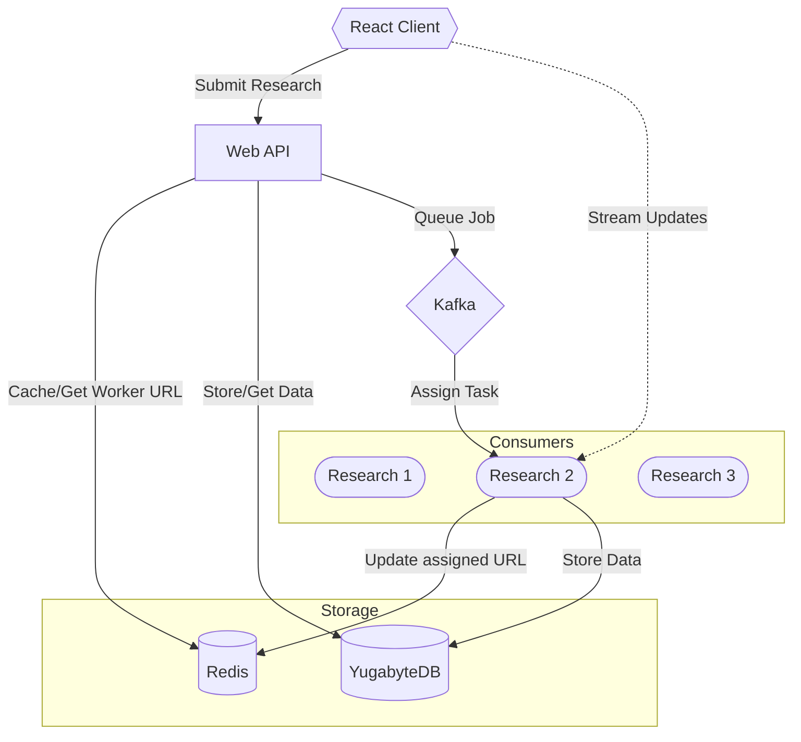
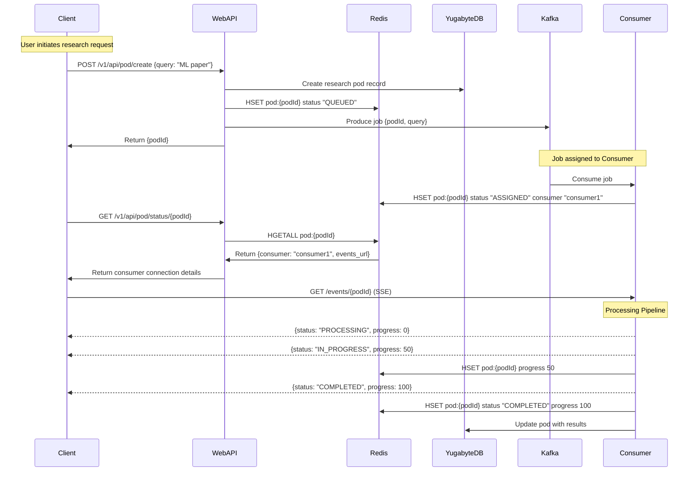

# Research Pod API

Our team's distributed research analysis system. The system uses RAG (Retrieval-Augmented Generation) to process academic papers from arXiv and provide AI-powered insights. This document explains how everything works and how to get it running.

### Key Components
- **Paper Processing**: Automatically scrapes arXiv papers and converts them to a format our AI can understand
- **AI Analysis**: Uses our custom RAG setup with DeepSeek Chat/Azure OpenAI and vector search
- **Message Queue**: Uses Kafka to handle multiple papers at once without overloading
- **Vector Search**: Uses pgvector to store transcripts and find similar research pods
- **Database**: YugabyteDB for distributed SQL storage with high availability
- **Storage**: Azure Blob Storage for audio file storage
- **Smart Recommendations**: Automatically suggests similar research pods based on transcript content
- **Deployment Options**: Can run locally or on our Kubernetes cluster

### Technical Stack
- **AI Models**: DeepSeek Chat/Azure OpenAI for generating text, OpenAI/Azure AI for embeddings
- **Storage**: Azure Blob Storage for audio files
- **Speech**: Kokoro TTS service for high-quality audio generation
- **Architecture**: Event-driven with Kafka for reliability
- **PDF Handling**: Uses pymupdf4llm for converting PDFs to clean text
- **Database**: YugabyteDB (Postgres-compatible distributed SQL)
- **Infrastructure**: Kubernetes configs with optional GPU support for TTS

## How It Works

The system processes research queries by scraping relevant papers from arXiv, analyzing them using RAG (Retrieval-Augmented Generation), and generating audio summaries. It also maintains a vector database of all generated transcripts, enabling it to recommend similar research pods based on content similarity.

## System Architecture



## Flow with Single Consumer



### Main Parts
1. **Web API**
   - Takes requests from our frontend
   - Manages async jobs (since paper processing takes time)
   - Validates input to prevent garbage requests
   - Stores research data in YugabyteDB
   - Returns hydrated recommendations with audio playback

2. **Research Consumer**
   - Does the heavy lifting of paper processing
   - Runs our RAG pipeline
   - Maintains vector embeddings of transcripts
   - Finds similar research pods using MMR search
   - Stores results in YugabyteDB
   - Generates audio summaries using TTS service

3. **Message System**
   - Uses Kafka to handle multiple requests
   - Keeps track of which papers are being processed
   - Has error handling for when things go wrong

4. **Database**
   - Uses YugabyteDB for distributed SQL storage
   - Stores research pod data, results, and metadata
   - Highly available with automatic failover
   - PostgreSQL-compatible for easy integration

5. **TTS Service**
   - GPU-accelerated text-to-speech conversion
   - Supports multiple voices and languages
   - Used for creating audio summaries
   - Only available in cloud deployments with GPU support

## Getting Started

Endpoints are currently deployed to:
- Web API:
  - `https://api.richardr.dev/v1/api/pod/create`
  - `https://api.richardr.dev/v1/api/pod/status/{pod_id}`
  - `https://api.richardr.dev/v1/api/pod/get/{pod_id}` (for full details, cached)
  - `https://api.richardr.dev/v1/api/pods` (paginated list, cached)
- Kafka monitoring: `https://kafkaui.richardr.dev`
- Event stream: `https://research-consumer-{0|1|2}.richardr.dev/v1/events/{pod_id}`

> **Note**: The deployed version is set up on my domain for now. There are 3 consumers running to handle requests.

### Option 1: Local Setup (Easiest)

1. Clone the repo:
```bash
git clone https://github.com/richardr1126/research-pod-api.git
cd research-pod-api
cp research/template.env research/.env
```

2. Create a `.env` file in the `research` directory with your Azure OpenAI and Blob Storage keys:
> Note: Contact Richard for the env file.
```env
AZURE_OPENAI_KEY=azure-openai-key
AZURE_STORAGE_CONNECTION_STRING=azure-blob-storage-connection-string
```

3. Start everything:
```bash
docker compose up --build
```

4. Check it's working:
   - API endpoint: http://localhost:8888
   - Kafka monitoring: http://localhost:8080

5. Try it out:
```bash
curl -X POST http://localhost:8888/v1/api/pod/create \
  -H "Content-Type: application/json" \
  -d '{"query": "quantum computing"}'
```

6. Connect to stream:
```bash
curl -N http://localhost:8081/v1/events/{job_id}
```

### Running Tests

Run the tests using Docker Compose:
```bash
docker compose run --rm web-api pytest -v
```
or if need to rebuild:
```bash
docker compose down && docker compose rm
docker compose run --rm --build web-api pytest -v
```
or if already running in `docker compose up`:
```bash
docker compose exec web-api pytest -v
```

The test suite includes:
- Health check endpoint tests
- API endpoint validation
- Full pod lifecycle tests
- Error handling tests

### Option 2: Cloud Setup (AKS/DO/GCP)

Deployment to Kubernetes is supported on:
- Azure Kubernetes Service (AKS)
- Digital Ocean Kubernetes
- Google Cloud Platform (GCP)

For detailed cloud deployment instructions, see [k8s/README.md](k8s/README.md).

Each cloud provider has a dedicated script:
```bash
# For Azure
./k8s/azure.sh

# For Digital Ocean
./k8s/digitalocean.sh

# For Google Cloud
./k8s/gcp.sh
```

The scripts will:
- Create a Kubernetes cluster
- Set up container registry
- Configure DNS settings
- Deploy required services including:
  - Kafka with SSL/TLS encryption
  - Redis
  - Kafka UI
  - External DNS
  - Cert Manager
  - NGINX Ingress Controller
  - Research Consumer service
  - Web API service

## API Details

### Testing Flow

1. Start a research job:
```bash
curl -X POST http://localhost:8888/v1/api/pod/create \
  -H "Content-Type: application/json" \
  -d '{"query": "quantum computing advances 2024"}'
```

```json
# Response:
{
  "status": "success",
  "message": "Scrape request queued",
  "pod_id": "550e8400-e29b-41d4-a716-446655440000",
  "events_url": "http://localhost:8081/v1/events/550e8400-e29b-41d4-a716-446655440000"
}
```

2. Check job status:
```bash
curl http://localhost:8888/v1/api/pod/status/550e8400-e29b-41d4-a716-446655440000
```

```json
# Response:
{
  "pod_id": "550e8400-e29b-41d4-a716-446655440000",
  "status": "PROCESSING",
  "progress": 33,
  "query": "quantum computing advances 2024",
  "events_url": "http://localhost:8081/v1/events/550e8400-e29b-41d4-a716-446655440000"
}
```

3. Connect to event stream to receive real-time updates:
```bash
curl -N http://localhost:8081/v1/events/550e8400-e29b-41d4-a716-446655440000
```

```json
# You'll receive SSE events like:
event: status
data: {"status": "PROCESSING", "progress": 0, "message": "Starting paper collection"}

event: status
data: {"status": "IN_PROGRESS", "progress": 33, "message": "Found 5 relevant papers"}

event: papers
data: {"papers": ["Paper 1 Title", "Paper 2 Title", ...]}

event: status
data: {"status": "IN_PROGRESS", "progress": 66, "message": "Analyzing papers"}

event: analysis
data: {"key_findings": "Recent breakthrough in..."}

event: status
data: {"status": "COMPLETED", "progress": 100, "message": "Analysis complete"}
```

## Endpoints
### (research-consumer) GET /v1/events/{pod_id}
Connect to the event stream for a specific job.

### POST /v1/api/pod/create
This is how you request a paper analysis.

Send this:
```json
{
  "query": "string"  // What you want to research
}
```

You'll get back:
```json
{
  "status": "success",
  "message": "Scrape request queued",
  "pod_id": "uuid-string",   // ID for database record and tracking
  "events_url": "http://localhost:8081/v1/events/uuid-string"
}
```

### GET /v1/api/pod/status/{pod_id}
Get pod status:
```json
{
  "pod_id": "uuid-string",
  "status": "QUEUED|ASSIGNED|PROCESSING|IN_PROGRESS|COMPLETED|ERROR",
  "message": "Any message from the consumer",
  "progress": 0-100,
  "query": "original query",
  "events_url": "https://research-consumer-{id}.richardr.dev/v1/events/{pod_id}"
}
```

### GET /v1/api/pod/get/{pod_id}
Get full research pod details from database (results are cached in Redis):
```json
{
  "id": "uuid-string",
  "query": "original query",
  "transcript": "TTS-optimized text",
  "audio_url": "https://researchpod.blob.core.windows.net/researchpod-audio/{pod_id}/audio.mp3",
  "sources_arxiv": ["paper sources"],
  "sources_ddg": ["web sources"],
  "status": "QUEUED|PROCESSING|COMPLETED|ERROR",
  "error_message": "Any error details",
  "progress": 0-100,
  "consumer_id": "consumer identifier",
  "created_at": "ISO timestamp",
  "updated_at": "ISO timestamp",
  "similar_pods": [
    {
      "id": "uuid-string",
      "query": "similar query",
      "audio_url": "audio url for similar pod",
      "created_at": "ISO timestamp"
    }
  ]
}
```

The `similar_pods` array contains up to 5 related research pods, determined by semantic similarity between transcripts using pgvector's Maximum Marginal Relevance (MMR) search. This helps reduce redundancy in recommendations while maintaining diversity.

### GET /v1/api/pods
Get a paginated list of research pods. Results are cached in Redis.

Query Parameters:
- `limit` (integer, optional, default: 10, max: 100): Number of pods to return.
- `offset` (integer, optional, default: 0): Number of pods to skip.

Returns an array of pod objects similar to the `/v1/api/pod/get/{pod_id}` response, but potentially less detailed depending on the `to_dict()` implementation used. Example:
```json
[
  {
    "id": "uuid-string-1",
    "query": "query 1",
    "status": "COMPLETED",
    "created_at": "ISO timestamp",
    "updated_at": "ISO timestamp"
    // ... other fields as defined in ResearchPods.to_dict() ...
  },
  {
    "id": "uuid-string-2",
    "query": "query 2",
    "status": "PROCESSING",
    "created_at": "ISO timestamp",
    "updated_at": "ISO timestamp"
    // ... other fields ...
  }
]
```

### GET /health
Checks if everything's running ok.

Returns:
```json
{
  "status": "healthy",
  "redis": "healthy|unhealthy",
  "kafka_producer": "healthy|unhealthy",
  "database": "healthy|unhealthy",
  "timestamp": "ISO timestamp"
}
```

### Project Layout
```
research-pod-api/
├── research/           # Does the AI/paper processing
│   ├── consumer.py     # Handles Kafka messages
│   ├── rag/           # Our RAG implementation
│   ├── scraper/       # Gets papers from arXiv
│   └── speech/        # Text-to-speech service client
├── web/               # The API service
│   └── server.py      # Main Flask app
├── k8s/               # Kubernetes stuff
│   ├── azure.sh       # Azure setup
│   ├── digitalocean.sh # DO setup 
│   ├── gcp.sh         # GCP setup
│   └── helm/          # Deployment configs
└── docker-compose.yml # Local setup
```