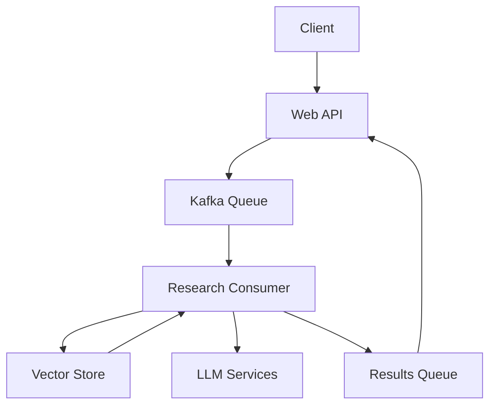

# Research Pod API

A distributed research analysis system that uses RAG (Retrieval-Augmented Generation) to process academic papers and provide intelligent insights.

## Features

### Core Capabilities
- **Paper Analysis**: Automated arXiv paper scraping and processing
- **RAG Pipeline**: Combines LangChain, DeepSeek Chat, and Milvus Lite for intelligent analysis
- **Distributed Processing**: Kafka-based message queue for scalable operation
- **Multi-Architecture Support**: AMD64 and ARM64 support via Docker buildx
- **Vector Search**: Milvus Lite for efficient similarity search
- **Flexible Deployment**: Local development (Docker Compose), Minikube, or AKS deployment

### Technical Highlights
- **LLM Integration**: DeepSeek Chat for text generation, OpenAI for embeddings
- **Async Processing**: Event-driven architecture with Kafka
- **PDF Processing**: Advanced PDF to markdown conversion with pymupdf4llm
- **Kubernetes Ready**: Production-grade deployment configurations
- **Infrastructure as Code**: Terraform for AKS provisioning

## System Architecture



### Components
1. **Web API**
   - RESTful endpoints
   - Async job management
   - Request validation

2. **Research Consumer**
   - Paper scraping and processing
   - RAG-based analysis
   - Vector storage management

3. **Message Queue**
   - Kafka for reliable messaging
   - Topic-based routing
   - Error handling queue

## Quick Start

### Local Development with Docker Compose

1. Clone and setup:
```bash
git clone https://github.com/richardr1126/research-pod-api.git
cd research-pod-api
cp research/template.env research/.env
```

2. Configure environment:
```env
KAFKA_BOOTSTRAP_SERVERS=kafka:29092
DEEPSEEK_API_KEY=your-key
OPENAI_API_KEY=your-key
AZURE_OPENAI_KEY=your-key
AZURE_OPENAI_ENDPOINT=your-endpoint
```

3. Start services:
```bash
docker compose up --build
```

4. Access services:
   - Web API: http://localhost:8888
   - Kafka UI: http://localhost:8080

5. Test the API:
```bash
curl -X POST http://localhost:8888/v1/api/scrape \
  -H "Content-Type: application/json" \
  -d '{"query": "latest developments in quantum computing"}'
```

### Kubernetes Deployment

For Kubernetes deployment instructions, see [Kubernetes Deployment Guide](research/k8s/README.md)

Key differences in Kubernetes deployment:
- Web API runs externally to the cluster
- Kafka and Kafka UI are exposed via LoadBalancer services
- Access URLs will depend on your LoadBalancer IP addresses

## API Reference

### POST /v1/api/scrape
Submit a research paper analysis request.

Request:
```json
{
  "query": "string"  // Research topic or question
}
```

Response:
```json
{
  "status": "success",
  "message": "Scrape request queued",
  "job_id": "uuid-string"
}
```

### GET /health
System health check endpoint.

Response:
```json
{
  "status": "healthy"
}
```

## Development

### Prerequisites
- Python 3.12+
- Docker with buildx support
- 4GB RAM minimum
- Azure subscription (for cloud deployment)

### Project Structure
```
research-pod-api/
├── research/           # Research consumer service
│   ├── consumer.py     # Kafka consumer
│   ├── rag/           # RAG implementation
│   └── scraper/       # Paper scraping
├── web/               # Web API service
│   └── server.py      # Flask application
└── kubernetes/        # K8s configurations
```

### Local Testing
```bash
# Create virtual environment
python -m venv venv
source venv/bin/activate

# Install dependencies
pip install -r research/requirements.txt
pip install -r web/requirements.txt
```

## Configuration

### Environment Variables

| Variable | Required | Description |
|----------|----------|-------------|
| KAFKA_BOOTSTRAP_SERVERS | Yes | Kafka connection string |
| DEEPSEEK_API_KEY | Yes | DeepSeek Chat API key |
| OPENAI_API_KEY | Yes | OpenAI API key |
| AZURE_OPENAI_KEY | Yes | Azure OpenAI key |
| AZURE_OPENAI_ENDPOINT | Yes | Azure OpenAI endpoint |

### Resource Requirements

#### Minimum
- CPU: 2 cores
- Memory: 4GB
- Storage: 30GB

#### Recommended
- CPU: 4 cores
- Memory: 8GB
- Storage: 50GB

## Contributing

1. Fork the repository
2. Create a feature branch (`git checkout -b feature/amazing-feature`)
3. Commit changes (`git commit -m 'Add amazing feature'`)
4. Push to branch (`git push origin feature/amazing-feature`)
5. Open a Pull Request

## License

This project is licensed under the MIT License - see [LICENSE](LICENSE) for details.