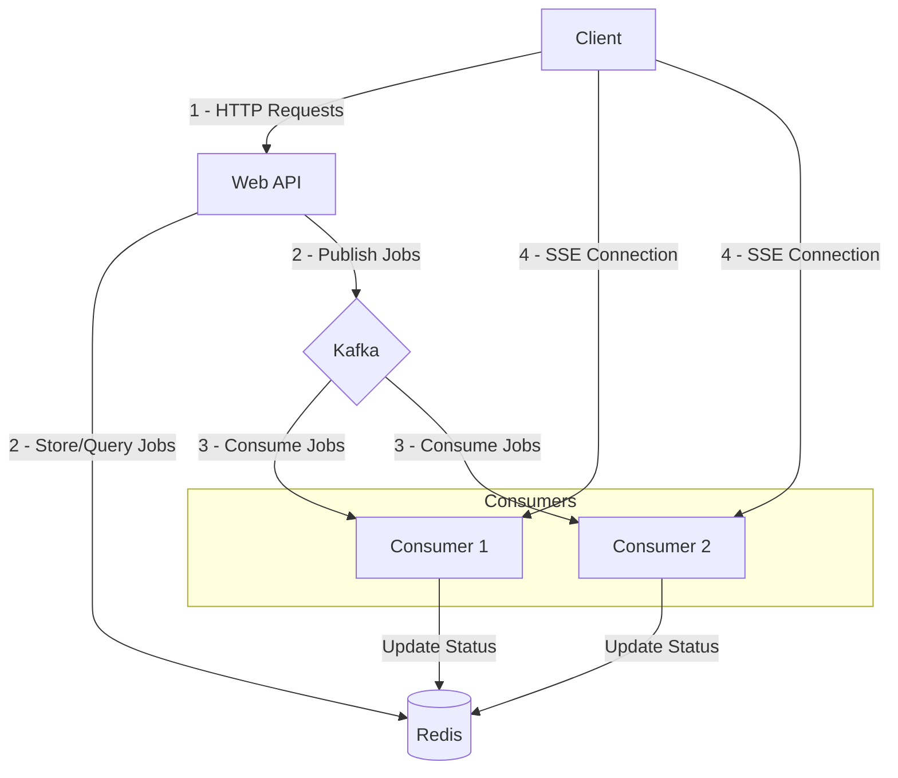
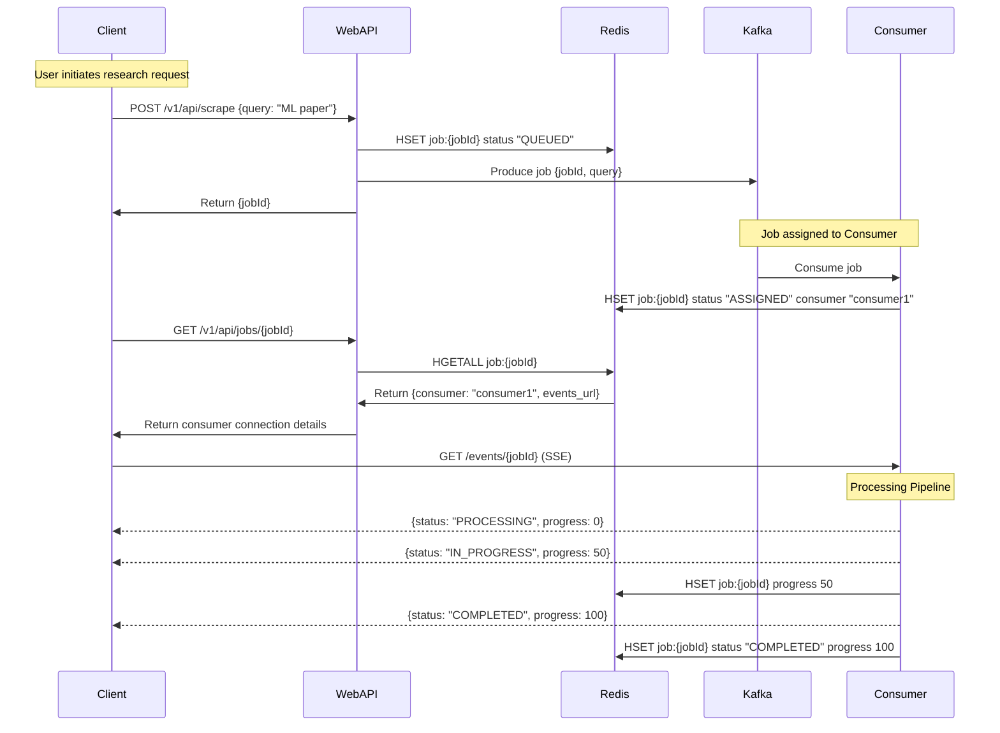
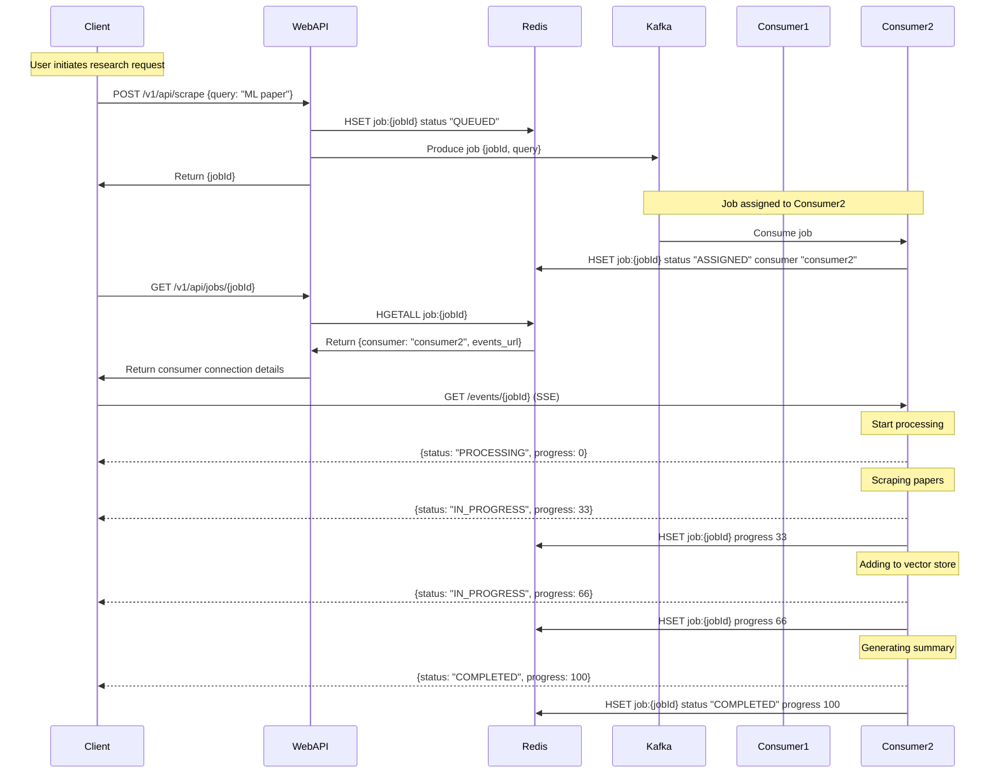

# Research Pod API

Our team's distributed research analysis system. The system uses RAG (Retrieval-Augmented Generation) to process academic papers from arXiv and provide AI-powered insights. This document explains how everything works and how to get it running.

### Key Components
- **Paper Processing**: Automatically scrapes arXiv papers and converts them to a format our AI can understand
- **AI Analysis**: Uses our custom RAG setup with DeepSeek Chat and vector search
- **Message Queue**: Uses Kafka to handle multiple papers at once without overloading
- **Vector Search**: Uses Milvus Lite to store and find similar content
- **Deployment Options**: Can run locally or on our Kubernetes cluster

### Technical Stack
- **AI Models**: DeepSeek Chat for generating text, OpenAI for creating embeddings
- **Architecture**: Event-driven with Kafka for reliability
- **PDF Handling**: Uses pymupdf4llm for converting PDFs to clean text
- **Infrastructure**: Kubernetes configs for our development and future production setup

## How It Works

## System Architecture



## Flow with Single Consumer



## Flow with Multiple Consumers


### Main Parts
1. **Web API**
   - Takes requests from our frontend
   - Manages async jobs (since paper processing takes time)
   - Validates input to prevent garbage requests

2. **Research Consumer**
   - Does the heavy lifting of paper processing
   - Runs our RAG pipeline
   - Manages the vector database

3. **Message System**
   - Uses Kafka to handle multiple requests
   - Keeps track of which papers are being processed
   - Has error handling for when things go wrong

## Getting Started

### Option 1: Local Setup (Easiest)

1. Get the code and set up env:
```bash
git clone https://github.com/richardr1126/research-pod-api.git
cd research-pod-api
cp research/template.env research/.env
```

2. Add only the required keys to .env (ask Richard for these if needed):
```env
DEEPSEEK_API_KEY=your-key
OPENAI_API_KEY=your-key
```

3. Start everything:
```bash
docker compose up --build
```

4. Check it's working:
   - API endpoint: http://localhost:8888
   - Kafka monitoring: http://localhost:8080

5. Try it out:
```bash
curl -X POST http://localhost:8888/v1/api/scrape \
  -H "Content-Type: application/json" \
  -d '{"query": "latest developments in quantum computing"}'
```

6. Connect to stream:
```bash
curl -N -H "Accept: text/event-stream" http://localhost:8081/events/{job_id}
```   

**Important**: See [k8s/README.md](k8s/README.md) for:
- Detailed setup instructions for Azure and Digital Ocean
- Troubleshooting
- Cleanup procedures

### Option 2: Cloud Setup

Deployment to Azure Kubernetes Service (AKS) or Digital Ocean Kubernetes. 

For cloud deployment instructions, see:
- Azure setup: Follow `azure.sh` instructions in [k8s/README.md](k8s/README.md#2-azure-kubernetes-service-aks)
- Digital Ocean setup: Follow `digitalocean.sh` instructions in [k8s/README.md](k8s/README.md#3-digital-ocean-kubernetes)

## API Details

### POST /v1/api/scrape
This is how you request a paper analysis.

Send this:
```json
{
  "query": "string"  // What you want to research
}
```

You'll get back:
```json
{
  "status": "success",
  "message": "Scrape request queued",
  "job_id": "uuid-string"  // Save this to check status later
}
```

### GET /health
Checks if everything's running ok.

Returns:
```json
{
  "status": "healthy"
}
```

### Project Layout
```
research-pod-api/
├── research/           # Does the AI/paper processing
│   ├── consumer.py     # Handles Kafka messages
│   ├── rag/           # Our RAG implementation
│   └── scraper/       # Gets papers from arXiv
├── web/               # The API service
│   └── server.py      # Main Flask app
├── k8s/               # Kubernetes stuff
│   └── helm/          # Deployment configs
└── docker-compose.yml # Local setup
```