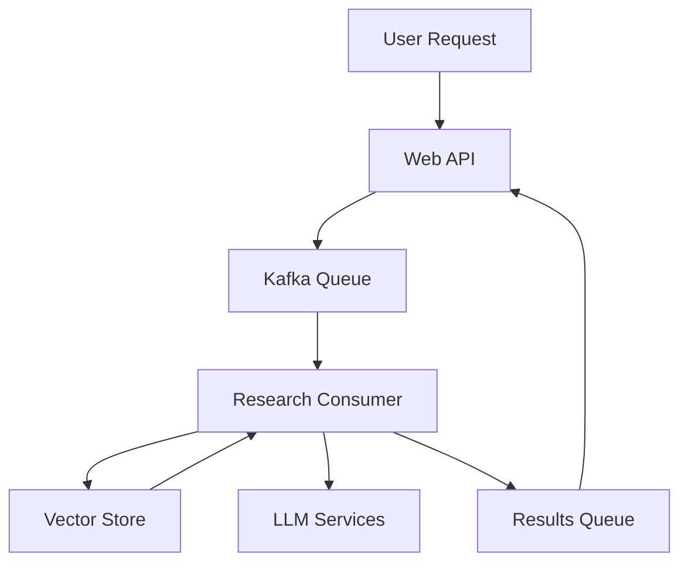
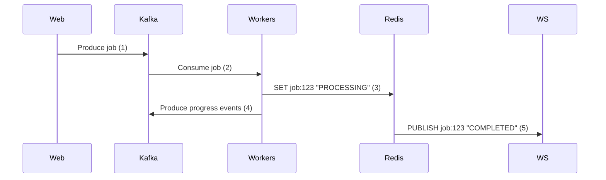

# Research Pod API

Our team's distributed research analysis system. The system uses RAG (Retrieval-Augmented Generation) to process academic papers from arXiv and provide AI-powered insights. This document explains how everything works and how to get it running.

## What This Does right now

This system helps us analyze research papers by:
1. Taking a research query from the user
2. Finding relevant papers on arXiv
3. Processing them through our AI pipeline
4. Returning insights and summaries

### Key Components
- **Paper Processing**: Automatically scrapes arXiv papers and converts them to a format our AI can understand
- **AI Analysis**: Uses our custom RAG setup with DeepSeek Chat and vector search
- **Message Queue**: Uses Kafka to handle multiple papers at once without overloading
- **Vector Search**: Uses Milvus Lite to store and find similar content
- **Deployment Options**: Can run locally or on our Kubernetes cluster

### Technical Stack
- **AI Models**: DeepSeek Chat for generating text, OpenAI for creating embeddings
- **Architecture**: Event-driven with Kafka for reliability
- **PDF Handling**: Uses pymupdf4llm for converting PDFs to clean text
- **Infrastructure**: Kubernetes configs for our development and future production setup

## How It Works





### Main Parts
1. **Web API**
   - Takes requests from our frontend
   - Manages async jobs (since paper processing takes time)
   - Validates input to prevent garbage requests

2. **Research Consumer**
   - Does the heavy lifting of paper processing
   - Runs our RAG pipeline
   - Manages the vector database

3. **Message System**
   - Uses Kafka to handle multiple requests
   - Keeps track of which papers are being processed
   - Has error handling for when things go wrong

## Getting Started

### Option 1: Local Setup (Easiest)

1. Get the code and set up env:
```bash
git clone https://github.com/richardr1126/research-pod-api.git
cd research-pod-api
cp research/template.env research/.env
```

2. Add your API keys to .env (ask Richard for these if needed):
```env
KAFKA_BOOTSTRAP_SERVERS=kafka:29092
DEEPSEEK_API_KEY=your-key
OPENAI_API_KEY=your-key
AZURE_OPENAI_KEY=your-key
AZURE_OPENAI_ENDPOINT=your-endpoint
```

3. Start everything:
```bash
docker compose up --build
```

4. Check it's working:
   - API endpoint: http://localhost:8888
   - Kafka monitoring: http://localhost:8080

5. Try it out:
```bash
curl -X POST http://localhost:8888/v1/api/scrape \
  -H "Content-Type: application/json" \
  -d '{"query": "latest developments in quantum computing"}'
```

### Option 2: Minikube Setup (For K8s Testing)

For detailed Kubernetes deployment instructions, see our [Kubernetes Setup Guide](k8s/README.md).

Quick start with Minikube:

1. Prerequisites:
   - Minikube installed
   - kubectl configured
   - Helm v3.x installed
   - Docker with buildx support
   - Python 3.12+

2. Start Minikube:
```bash
minikube start
```

3. Run the setup:
```bash
cd k8s/helm
chmod +x setup.sh
./setup.sh
```

4. Required additional steps:
   - Open a new terminal and run `minikube tunnel` (keep this running)
   - Configure Docker to use Minikube's registry: `eval $(minikube docker-env)`
   - Set up environment variables from template
   - Start the web server

**Important**: See [k8s/README.md](k8s/README.md) for:
- Detailed setup instructions for Minikube, Azure, and Digital Ocean
- Troubleshooting common issues
- Instructions for monitoring and maintenance
- Cleanup procedures

### Option 3: Cloud Setup

We support deployment to both Azure Kubernetes Service (AKS) and Digital Ocean Kubernetes. 

For cloud deployment instructions, see:
- Azure setup: Follow `azure.sh` instructions in [k8s/README.md](k8s/README.md#2-azure-kubernetes-service-aks)
- Digital Ocean setup: Follow `digitalocean.sh` instructions in [k8s/README.md](k8s/README.md#3-digital-ocean-kubernetes)

## API Details

### POST /v1/api/scrape
This is how you request a paper analysis.

Send this:
```json
{
  "query": "string"  // What you want to research
}
```

You'll get back:
```json
{
  "status": "success",
  "message": "Scrape request queued",
  "job_id": "uuid-string"  // Save this to check status later
}
```

### GET /health
Checks if everything's running ok.

Returns:
```json
{
  "status": "healthy"
}
```

## Development Setup

### What You Need
- Python 3.12+ (3.11 won't work due to some dependencies)
- Docker with buildx
- At least 4GB RAM (8GB recommended)
- Minikube if you want to test K8s stuff
- Azure account (for later)

### Project Layout
```
research-pod-api/
├── research/           # Does the AI/paper processing
│   ├── consumer.py     # Handles Kafka messages
│   ├── rag/           # Our RAG implementation
│   └── scraper/       # Gets papers from arXiv
├── web/               # The API service
│   └── server.py      # Main Flask app
├── k8s/               # Kubernetes stuff
│   └── helm/          # Deployment configs
└── docker-compose.yml # Local setup
```

### How to Run It

1. **Local Dev** (Docker Compose)
   - Easiest way to test changes
   - Everything runs in Docker
   - Good for most development

2. **Local K8s** (Minikube)
   - Tests our Kubernetes setup
   - More like how it'll run in production
   - Use this before pushing to cloud

3. **Cloud** (AKS)
   - Our production setup (coming soon)
   - Will be fully scalable
   - Instructions coming soon

### Testing Locally
```bash
# Set up Python environment
python -m venv venv
source venv/bin/activate

# Install what you need
pip install -r research/requirements.txt
pip install -r web/requirements.txt
```

#### Run the Web Server
Start the web server with 3 workers (3 simultaneous connections during wait)

```bash
cd web
gunicorn --bind 0.0.0.0:8888 --workers 3 server:server --log-level DEBUG
```

## Configuration

### Environment Variables You Need

| Variable | Required | What it's for |
|----------|----------|-------------|
| KAFKA_BOOTSTRAP_SERVERS | Yes | How to connect to Kafka |
| DEEPSEEK_API_KEY | Yes | For using DeepSeek Chat for text generation |
| OPENAI_API_KEY | Yes | For text-embedding-3-large embeddings |
| AZURE_OPENAI_KEY | No | Backup text generation service |
| AZURE_OPENAI_ENDPOINT | No | Azure OpenAI API endpoint for backup |

### System Requirements

For development:
- 2 CPU cores minimum
- 4GB RAM minimum
- 30GB storage

For better performance:
- 4+ CPU cores
- 8GB+ RAM
- 50GB+ storage