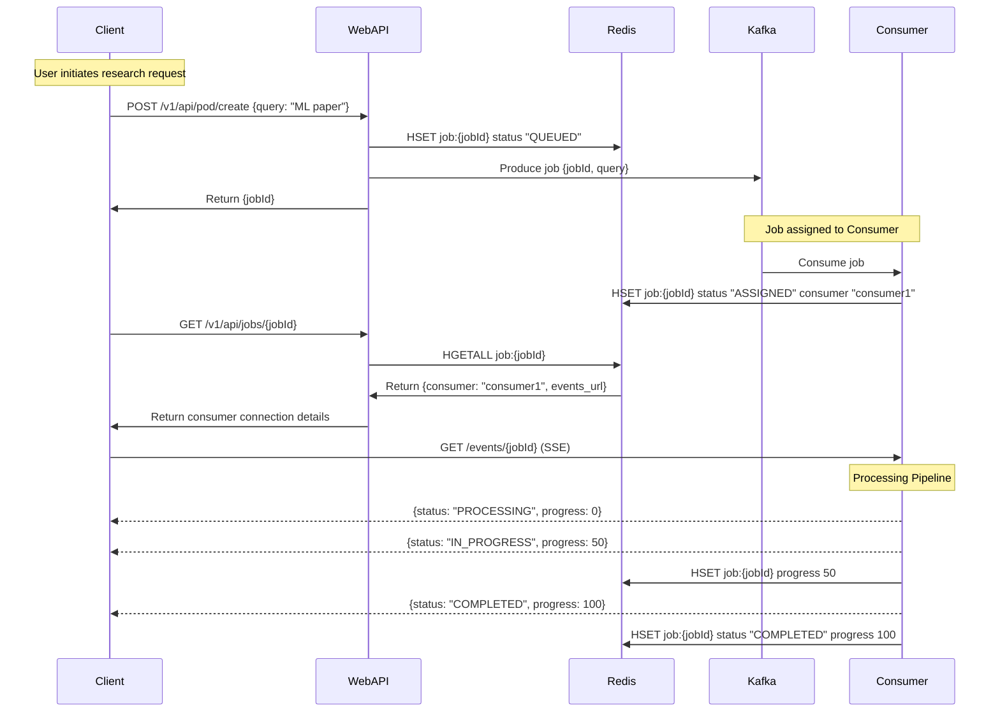
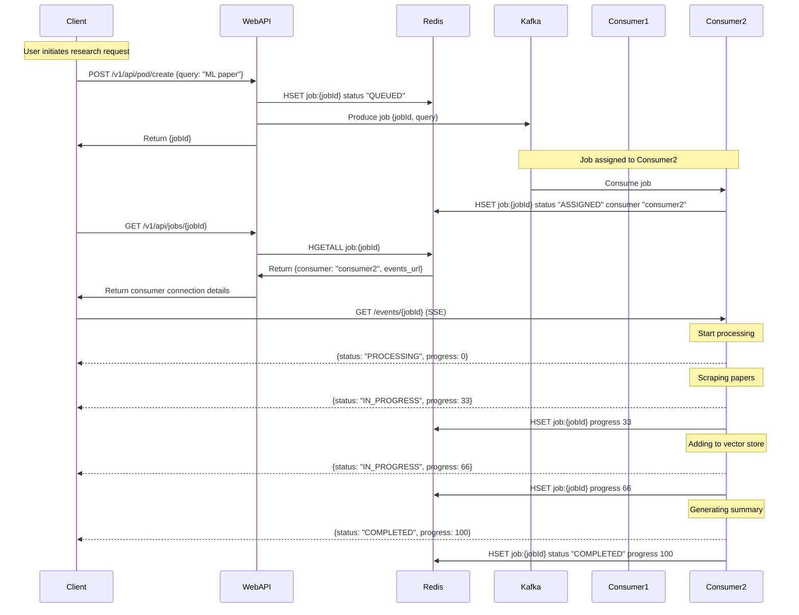

# Research Pod API

Our team's distributed research analysis system. The system uses RAG (Retrieval-Augmented Generation) to process academic papers from arXiv and provide AI-powered insights. This document explains how everything works and how to get it running.

### Key Components
- **Paper Processing**: Automatically scrapes arXiv papers and converts them to a format our AI can understand
- **AI Analysis**: Uses our custom RAG setup with DeepSeek Chat and vector search
- **Message Queue**: Uses Kafka to handle multiple papers at once without overloading
- **Vector Search**: Uses Milvus Lite to store and find similar content
- **Deployment Options**: Can run locally or on our Kubernetes cluster

### Technical Stack
- **AI Models**: DeepSeek Chat for generating text, OpenAI for creating embeddings
- **Architecture**: Event-driven with Kafka for reliability
- **PDF Handling**: Uses pymupdf4llm for converting PDFs to clean text
- **Infrastructure**: Kubernetes configs for our development and future production setup

## How It Works

## System Architecture


## Flow with Single Consumer



## Flow with Multiple Consumers


### Main Parts
1. **Web API**
   - Takes requests from our frontend
   - Manages async jobs (since paper processing takes time)
   - Validates input to prevent garbage requests

2. **Research Consumer**
   - Does the heavy lifting of paper processing
   - Runs our RAG pipeline
   - Manages the vector database

3. **Message System**
   - Uses Kafka to handle multiple requests
   - Keeps track of which papers are being processed
   - Has error handling for when things go wrong

## Getting Started

Endpoints are currently deployed to:
- Web API:
  - `https://api.richardr.dev/v1/api/pod/create`
  - `https://api.richardr.dev/v1/api/pod/status/<job_id>`
- Kafka monitoring: `https://kafkaui.richardr.dev`
- Event stream: `https://research-consumer-{0|1|2}.richardr.dev/v1/events/{job_id}`

> **Note**: The deployed version is set up on my domain for now. There are 3 consumers running to handle requests.

### Option 1: Local Setup (Easiest)

1. Get the code and set up env:
```bash
git clone https://github.com/richardr1126/research-pod-api.git
cd research-pod-api
cp research/template.env research/.env
```

2. Add only the required keys to .env (ask Richard for these if needed):
```env
DEEPSEEK_API_KEY=your-key
OPENAI_API_KEY=your-key
```

3. Start everything:
```bash
docker compose up --build
```

4. Check it's working:
   - API endpoint: http://localhost:8888
   - Kafka monitoring: http://localhost:8080

5. Try it out:
```bash
curl -X POST http://localhost:8888/v1/api/pod/create \
  -H "Content-Type: application/json" \
  -d '{"query": "latest developments in quantum computing"}'
```

6. Connect to stream:
```bash
curl -N -H "Accept: text/event-stream" http://localhost:8081/v1/events/{job_id}
```   

**Important**: See [k8s/README.md](k8s/README.md) for:
- Detailed setup instructions for Azure and Digital Ocean
- Troubleshooting
- Cleanup procedures

### Option 2: Cloud Setup (AKS/DO/GCP)

Deployment to Kubernetes is supported on:
- Azure Kubernetes Service (AKS)
- Digital Ocean Kubernetes
- Google Cloud Platform (GCP)

For detailed cloud deployment instructions, see [k8s/README.md](k8s/README.md).

Each cloud provider has a dedicated script:
```bash
# For Azure
./k8s/azure.sh

# For Digital Ocean
./k8s/digitalocean.sh

# For Google Cloud
./k8s/gcp.sh
```

The scripts will:
- Create a Kubernetes cluster
- Set up container registry
- Configure DNS settings
- Deploy required services including:
  - Kafka with SSL/TLS encryption
  - Redis
  - Kafka UI
  - External DNS
  - Cert Manager
  - NGINX Ingress Controller
  - Research Consumer service
  - Web API service

## API Details

### Testing Flow

1. Start a research job:
```bash
curl -X POST http://localhost:8888/v1/api/pod/create \
  -H "Content-Type: application/json" \
  -d '{"query": "quantum computing advances 2024"}'

# Response:
{
  "status": "success",
  "message": "Scrape request queued",
  "job_id": "550e8400-e29b-41d4-a716-446655440000",
  "events_url": "http://localhost:8081/v1/events/550e8400-e29b-41d4-a716-446655440000"
}
```

2. Check job status:
```bash
curl http://localhost:8888/v1/api/pod/status/550e8400-e29b-41d4-a716-446655440000

# Response:
{
  "job_id": "550e8400-e29b-41d4-a716-446655440000",
  "status": "PROCESSING",
  "progress": 33,
  "query": "quantum computing advances 2024",
  "events_url": "http://localhost:8081/v1/events/550e8400-e29b-41d4-a716-446655440000"
}
```

3. Connect to event stream to receive real-time updates:
```bash
curl -N http://localhost:8081/v1/events/550e8400-e29b-41d4-a716-446655440000

# You'll receive SSE events like:
event: status
data: {"status": "PROCESSING", "progress": 0, "message": "Starting paper collection"}

event: status
data: {"status": "IN_PROGRESS", "progress": 33, "message": "Found 5 relevant papers"}

event: papers
data: {"papers": ["Paper 1 Title", "Paper 2 Title", ...]}

event: status
data: {"status": "IN_PROGRESS", "progress": 66, "message": "Analyzing papers"}

event: analysis
data: {"key_findings": "Recent breakthrough in..."}

event: status
data: {"status": "COMPLETED", "progress": 100, "message": "Analysis complete"}
```

### POST /v1/api/pod/create
This is how you request a paper analysis.

Send this:
```json
{
  "query": "string"  // What you want to research
}
```

You'll get back:
```json
{
  "status": "success",
  "message": "Scrape request queued",
  "job_id": "uuid-string"  // Save this to check status later
}
```

### GET /v1/api/pod/status/{job_id}
Get job status:
```json
{
  "job_id": "uuid-string",
  "status": "QUEUED|ASSIGNED|PROCESSING|IN_PROGRESS|COMPLETED|ERROR",
  "progress": 0-100,
  "query": "original query",
  "events_url": "https://research-consumer-{id}.richardr.dev/v1/events/{job_id}"
}
```

### GET /v1/events/{job_id}
Server-Sent Events (SSE) endpoint for real-time updates.

Events:
- `status`: Job status updates
- `papers`: List of papers being analyzed
- `analysis`: Intermediate analysis results
- `error`: Any errors that occur

Example event types:
```json
// Status event
{
  "status": "IN_PROGRESS",
  "progress": 50,
  "message": "Processing papers"
}

// Papers event
{
  "papers": [
    {
      "title": "Recent Advances in Quantum Computing",
      "url": "https://arxiv.org/abs/...",
      "summary": "Brief overview..."
    }
  ]
}

// Analysis event
{
  "key_findings": "Text summarizing findings...",
  "related_topics": ["Topic 1", "Topic 2"]
}

// Error event
{
  "error": "Error message",
  "code": "ERROR_CODE"
}
```

### GET /health
Checks if everything's running ok.

Returns:
```json
{
  "status": "healthy",
  "redis": "healthy|unhealthy",
  "kafka_producer": "healthy|unhealthy"
}
```

### Project Layout
```
research-pod-api/
├── research/           # Does the AI/paper processing
│   ├── consumer.py     # Handles Kafka messages
│   ├── rag/           # Our RAG implementation
│   └── scraper/       # Gets papers from arXiv
├── web/               # The API service
│   └── server.py      # Main Flask app
├── k8s/               # Kubernetes stuff
│   ├── azure.sh       # Azure setup
│   ├── digitalocean.sh # DO setup 
│   ├── gcp.sh         # GCP setup
│   └── helm/          # Deployment configs
└── docker-compose.yml # Local setup
```